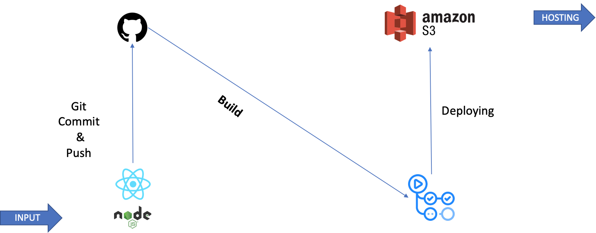

# Kyu's tech blog_Preview

## React Architecture

### React

* [React 공식 싸이트](https://ko.reactjs.org/)에 따르면, **"사용자 인터페이스를 만들기 위한 JavaScript 라이브러리"**라고 명시되어 있다. 
* 명시된 데로 이해를 한다면,  React js는 오직 web을 위해서 존재하는 라이브러리는 아니다. **User Interface를 만든다**에 목적이 있다. 즉,  web을 만들기 위해서는 react으로만 충분하지 않다. (ReactDom Libaray를 사용하는 이유가 바로  react를 web에서 사용하기 위함이다)

> Framework와 Library의 차이 그리고 가까운 용어들에 대한 설명은 다음 링크에 잘 정리되어 있다. [개발자스럽다](https://blog.gaerae.com/2016/11/what-is-library-and-framework-and-architecture-and-platform.html)

### Node.js

* web을 기반으로 하는 User Interface React JS 를 통해 사용하기 위해서는 React JS만으로 충분하지 않다. 조사한 결과 불가능한 것은 아니지만, 더 안정적이고 편안한 방법이 있는데 가지 않을 이유는 없기에, 우리는  Node.js를 선택한다.
* Node.js 공식 싸이트에서는 **"Node.js®는 [Chrome V8 JavaScript 엔진](https://v8.dev/)으로 빌드된 JavaScript 런타임입니다."**라고 하며, 위키피디아에서는, **"Node.js는 확장성 있는 네트워크 애플리케이션 개발에 사용되는 소프트웨어 플랫폼이다. "**으로 이야기한다.
*  Node.js를 사용하는 이유는, Node.js의 **강력한 장점**이 있기 때문이다.
  * npm(Node Package Manager)를 통해  registry를 위한 package를 설치할 수 있다.
  * Node는 reliable한  "Module Dependecy"를 갖고 있다.

> * [Why we need Node js for React js](https://jscomplete.com/learn/why-node-for-react)
>
> * Node js에 대체될 수 있는 다른 프레임 워크는 Ruby on Rails가 존재한다.

### create-react-app

* Facebook에서 react project를 만들기 쉽게 하기 위해 제공되는 tool이다.
* [create-react-app 공식  github]에서는 **"Create React apps with no build configuration."**라고 설명이 되어있다. 즉,  react app을 더 Simple한 방법으로 만들 수 있다.
  *  다른 개발자의 참여의 진입 장벽이 낮다
  * configuration 파일을 설정하는 time-consuming job을 하지 않아도 된다.

> 여기서 말하는  configuration에 대한 time-consuming을 말하는 이유는, 기본적으로 web을 개발하기 위해서 많은  depenency에 의존해야한다. 예를 들면 ``bable`` , ``webpack`` 등등. 하지만, CRA를 통해서는 이러한 기본 설정이 이미 정해져 있는 것이다.
>
> [Create-React-App에 대한 좋은 article 참고](https://geekscreed.com/blog/use-create-react-app-to-scaffold-next-react-app/)

### Github & Github Action

* Version 관리는 역시  Github을 사용하며, CI/CD를 위하여  GitHub Action을 사용한다.
*  Github Action과 AWS와의 연동을 통한  build는 다음 출처를 참고하였다.
  * [[Github Action] AWS S3에 React 프로젝트 배포하기]([https://velog.io/@loakick/Github-Action-AWS-S3%EC%97%90-React-%ED%94%84%EB%A1%9C%EC%A0%9D%ED%8A%B8-%EB%B0%B0%ED%8F%AC%ED%95%98%EA%B8%B0](https://velog.io/@loakick/Github-Action-AWS-S3에-React-프로젝트-배포하기))

### ASW

* 빌드와 베포는 AWS에서 실시한다.

* [6) AWS S3를 이용한 웹 호스팅](https://jongmin92.github.io/2017/07/17/Emily/6-aws-s3-static-web-hosting/)를 참고하여 AWS static web hosting을 설정하였다.

  > 아직 까지, Github Page와 React를 연동해서 실행하는 방법을 차지 못해서 빌드 및 배포를  AWS에 하는 방법을 선택하였다.