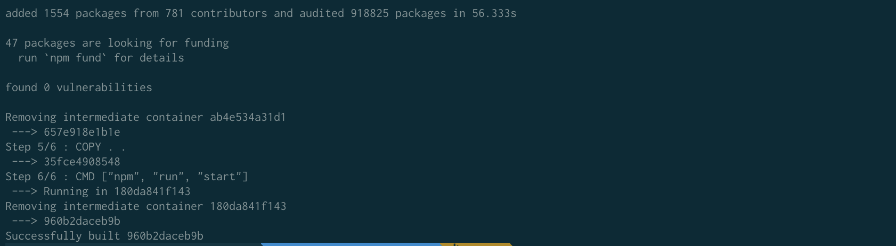

# Kyu's tech blog_Install

### Node js

### [Docker](https://www.docker.com/resources/what-container)

* [Docker를 이용해 간단한 React앱을 AWS에 배포해 보자 -01](https://mia-dahae.tistory.com/20)


> * A container is a standard unit of software that packages up code and all its dependencies so the application runs quickly and reliably from one computing environment to another.
> * A Docker container image is a lightweight, standalone, executable package of software that includes everything needed to run an application: code, runtime, system tools, system libraries and settings.

* Docker는 "Environment Disparity"를 해결하는 것이 주 목적이라고 한다. 
* 어느 프로젝트를 진행하던 항상 문제가 되는 부분은 역시 환경 문제이다.
  *  과거  음성 합성을 위해 anaconda 환경을 구축한적이 있었다. 하지만 중간 중간 환경에 문제가 생겨서 환경을 지우고 새로 설치하고 한적이 있었다. 환경을 쉽게 지우고 설치하는 것은 굉장히 편했으나, 재설치 과정이 있던 것이 아쉬웠다.(콘다 환경에도  docker와 비슷한 환경이 있는지는 모르겠다.) 여튼 이러한 일들을 하나의  image 파일로 변경하여 필요할 때마다,  container라는 녀석에서 구축하여 사용할 수 있다는 말이다.
  * 이렇게 환경의 문제를 손쉽게 해결 해줄 수 있는 것이 docker의 능력이다.

### CRA

```
sudo npm install creat-react-app
```


```
create-react-app ./
```

* 만약, ``zsh: command not found: create-react-app``의, ``npm install -g create-react-app``을 통해 다시 한번 설치한다
  * 아무래도, 이전에 react가 설치 되어 있어, create-react-app 찾지를 못하는 것 같다. 그래서 global로 설치하여 어디서든 설치 할 수 있게 변경한다.
  * [참고](https://github.com/facebook/create-react-app/issues/138)

```
npm run start
```

* 성공적으로 CRA를 생성하였다면, 해당 directory에서 위의  cmd를 통해서 다음과 같은 기본 react page를 확인 할 수 있다.

  

  

### Docker

* 기본  react-app이 설치가 되었다면, 이제 docker의 image를 만들어 보자.

* [Docker를 설치한다](https://hub.docker.com/editions/community/docker-ce-desktop-mac/)

* Dockerfile.dev

  ```
  FROM node:alpine
  
  WORKDIR '/app'
  
  COPY package.json .
  RUN npm install
  COPY . .
  
  CMD ["npm", "run", "start"]
  ```
  * 위와 같이 Dockerfile.dev를 작성한 후, 이미지 생서을 한다.

  ```zsh
  docker build -f Dockerfile.dev .
  ```

* Docker Build

  

  
  * docker build를 통해서 image를 생성하였다.

* 이미지를 컨테이너에 실행

  ```zsh
  docker run -p 3000:3000 <image id>
  ```

  * docker image를 생성했을 때, 마지막으로 보이는 ``960b2daceb9b``이 image의 id가 된다.
  * 위  cmd를 실행하고 3000 port에 접속하면 react-page를 확인 할 수 있다.

* 지금까지 쉽게 docker를 이해한다면, 다음과 같다

  * 내가 실행할 app의 환경을 이미지로 만든다.
  * container에는 project의 코드가 전부 포함되어 있다. 만약, code를 새롭게 작성하게 될 경우, contianer에 해당 사항들을 변경해줘야 한다.

  > 아직,  image와 container의 차이를 명확하게 구분하지 못하고 있다......이 부분에 대한 개념은 차후에 수정하도록하자!

* Source Code에 수정이 있을 경우 다음 command를 통해서 container에 속해있는 snap shot을 수정한다

  ````zsh
  docker run -p 3000:3000 -v /app/node_modules -v $(pwd):/app <image id>
  ````

* 매 번, Source Code가 바뀔 때마다 container에 추가하기가 어려우니, ``docker-compose.yml``을 작성하여 Source Code가 수정이 될 떄 마다 자동으로 container안의 Source Code를 수정하자.

  * docker-compose.yml

    ```yml
    version: "3"
    services:
      web:
        build:
          context: .
          dockerfile: Dockerfile.dev
        ports:
          - "3000:3000"
        volumes:
          - /app/node_modules
          - .:/app
    ```

  > * docker-compose.yml이란,  한번에 여러개의 container을 통합 관리하는 툴을 의미한다.
  > * docker 실행 옵션을 미리 적어둔 문서라고 보면 된다.
  > * 위 내용은  docker를 실행했을 경우, 위에 적혀있는데로, docker를 실행하게 되는 것 이다.

* docker-compose.yml을 이용한 빌드

  * ``docker-compose.yml``을 통해  ``Dockerfile.dv``를 빌드하고, 참고하는 volume과  port에 대한 정보를 작성하였다.

  * 다음 cmd를 통해서 container에 지속적으로 반영할 수 있다.

    ```zsh
    docker-compose up --build
    ```

    * 이렇게 된다면, container에는 지속적으로 Source Code의  Snap Shot을  update시켜 줄 수 있다.

---

* 일단 여기까지가 docker로 local에서 실행 시킬 수 있는 부분이다.
* AWS에 배포하는 부분은 차후에 다루겠다.


